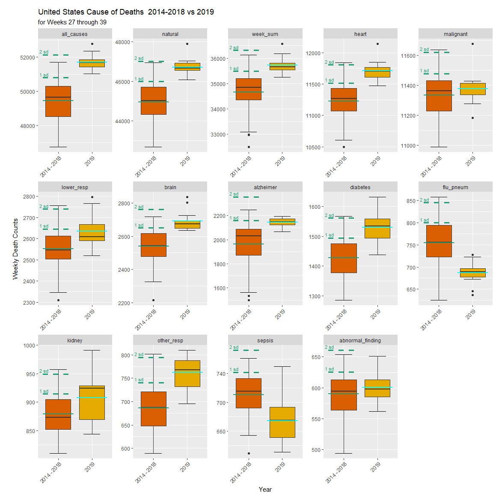
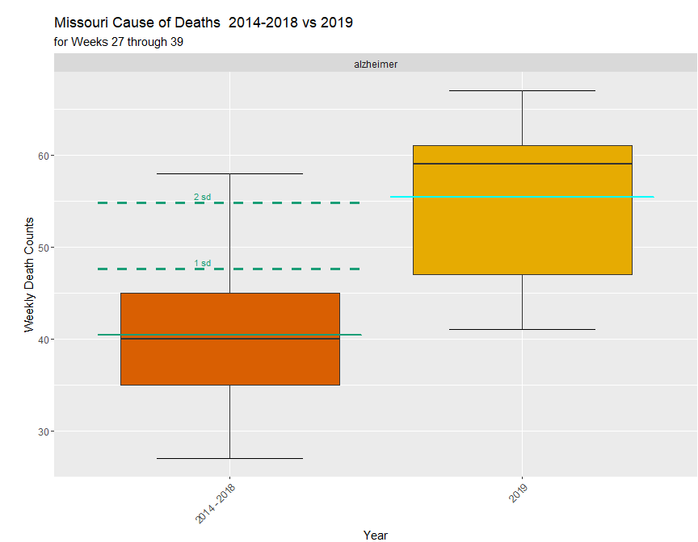

## Introduction

This report explores the Center for Disease Control's (CDC) Weekly Morbidity and 
Mortality data from 2014 to 2019. The data includes weekly death counts for 
specific causes in the United States. The data also includes weekly death counts 
for individual states and specific areas such as New York City, Puerto Rico and 
Washington, D.C. The data is voluntary and not guaranteed to be reported on a 
regular basis. Therefore, inference and causality statements are based on this 
data set and may not apply to the country or state as a whole. Information on 
the data set can be found in the [data description](data/test.pdf) file included 
in the data folder.


## Data Structure Exploration

The data set contains 16,902 observations and 
30 variables with the names shown below.


```
##  [1] "Jurisdiction.of.Occurrence"                                                                       
##  [2] "MMWR.Year"                                                                                        
##  [3] "MMWR.Week"                                                                                        
##  [4] "Week.Ending.Date"                                                                                 
##  [5] "All..Cause"                                                                                       
##  [6] "Natural.Cause"                                                                                    
##  [7] "Septicemia..A40.A41."                                                                             
##  [8] "Malignant.neoplasms..C00.C97."                                                                    
##  [9] "Diabetes.mellitus..E10.E14."                                                                      
## [10] "Alzheimer.disease..G30."                                                                          
## [11] "Influenza.and.pneumonia..J10.J18."                                                                
## [12] "Chronic.lower.respiratory.diseases..J40.J47."                                                     
## [13] "Other.diseases.of.respiratory.system..J00.J06.J30.J39.J67.J70.J98."                               
## [14] "Nephritis..nephrotic.syndrome.and.nephrosis..N00.N07.N17.N19.N25.N27."                            
## [15] "Symptoms..signs.and.abnormal.clinical.and.laboratory.findings..not.elsewhere.classified..R00.R99."
## [16] "Diseases.of.heart..I00.I09.I11.I13.I20.I51."                                                      
## [17] "Cerebrovascular.diseases..I60.I69."                                                               
## [18] "flag_allcause"                                                                                    
## [19] "flag_natcause"                                                                                    
## [20] "flag_sept"                                                                                        
## [21] "flag_neopl"                                                                                       
## [22] "flag_diab"                                                                                        
## [23] "flag_alz"                                                                                         
## [24] "flag_inflpn"                                                                                      
## [25] "flag_clrd"                                                                                        
## [26] "flag_otherresp"                                                                                   
## [27] "flag_nephr"                                                                                       
## [28] "flag_otherunk"                                                                                    
## [29] "flag_hd"                                                                                          
## [30] "flag_stroke"
```

The names given for the causes of death include clinical information and codes.
These names will be shortened to the primary organ involved or a two word
descriptor. 

Of the 30 columns, 13 
are used as flags indicating suppressed death data for weekly counts between the
values of 1 and 9. These values are suppressed in the original data to protect 
privacy. The flag columns will be dropped and the corresponding missing values 
for the causes of death will not be removed or replaced.


The reasoning for not dropping these rows is that the rows contain other 
useful information on other individual death causes. In addition, the missing 
values do give information such as the value was not zero but a value between 
1 and 9.  The missing values are not replaced due to the affect these artificial
values would have on the data leading to false assumptions and/or conclusions. 

A row named "week_sum" was added, giving the sum of all weekly causes of death 
except "all_causes" and "natural". These variables include counts given in other 
columns and therefore are excluded from the added sum column to prevent double
counting.

After the changes, the new column names are:


```
##  [1] "d_location"       "d_year"           "d_week"           "ending_week"     
##  [5] "all_causes"       "natural"          "sepsis"           "malignant"       
##  [9] "diabetes"         "alzheimer"        "flu_pneum"        "lower_resp"      
## [13] "other_resp"       "kidney"           "abnormal_finding" "heart"           
## [17] "brain"            "week_sum"
```

The d_location, d_year and d_week columns hold categorical information and will
be changed to factors. Ending_week gives the date of the last day for the week 
counted and will be changed into a date. There is a 53rd week for the 2014 year.
All weeks will be shifted back 1 so that week 53 in 2014 becomes 52, 52 becomes 
51, etc...  The new week 0 will be dropped. The new structure of the data is 
shown below.


The data set now contains 18 columns and 
16,848 observations.


```
## 'data.frame':	16848 obs. of  18 variables:
##  $ d_location      : Factor w/ 54 levels "Alabama","Alaska",..: 47 47 47 47 47 47 47 47 47 47 ...
##  $ d_year          : Ord.factor w/ 6 levels "2014"<"2015"<..: 1 1 1 1 1 1 1 1 1 1 ...
##  $ d_week          : Ord.factor w/ 52 levels "1"<"2"<"3"<"4"<..: 1 2 3 4 5 6 7 8 9 10 ...
##  $ ending_week     : Date, format: "2014-01-11" "2014-01-18" ...
##  $ all_causes      : int  56353 54769 54223 54074 53484 53910 52752 51768 52163 51912 ...
##  $ natural         : int  52450 51043 50560 50402 49790 50175 49010 47907 48353 48111 ...
##  $ sepsis          : int  905 919 845 890 849 851 708 779 777 819 ...
##  $ malignant       : int  11504 11496 11629 11584 11355 11477 11478 11251 11535 11340 ...
##  $ diabetes        : int  1735 1660 1602 1586 1643 1642 1564 1588 1536 1584 ...
##  $ alzheimer       : int  1917 1914 1862 1867 1873 1843 1814 1776 1830 1775 ...
##  $ flu_pneum       : int  1910 1920 1765 1642 1528 1472 1269 1228 1215 1153 ...
##  $ lower_resp      : int  3444 3333 3467 3283 3351 3303 3047 3008 3043 3112 ...
##  $ other_resp      : int  845 812 753 720 728 739 731 687 760 730 ...
##  $ kidney          : int  1098 1056 1029 998 1038 1021 973 1018 1040 987 ...
##  $ abnormal_finding: int  665 598 622 664 641 638 643 595 642 611 ...
##  $ heart           : int  13663 12928 12813 12896 12681 12984 12577 12248 12318 12375 ...
##  $ brain           : int  2738 2714 2720 2699 2684 2669 2799 2630 2529 2555 ...
##  $ week_sum        : int  40424 39350 39107 38829 38371 38639 37603 36808 37225 37041 ...
```

The structure of the new data frame after the changes is shown above.


# Analysis
### Distribution of US Data

Next, the data is split into a data frame for the United States data and another
containing the state and territory data. The US subset contains 
312 observations and the State subset contains 
16,536 observations. Next, we will look at 
summary statistics and missing data in both data subsets.


```
##          d_location   d_year       d_week     ending_week           all_causes       natural     
##  United States:312   2014:52   1      :  6   Min.   :2014-01-11   Min.   :46751   Min.   :42681  
##                      2015:52   2      :  6   1st Qu.:2015-07-09   1st Qu.:50453   1st Qu.:45849  
##                      2016:52   3      :  6   Median :2017-01-03   Median :52223   Median :47731  
##                      2017:52   4      :  6   Mean   :2017-01-03   Mean   :52994   Mean   :48526  
##                      2018:52   5      :  6   3rd Qu.:2018-07-01   3rd Qu.:55467   3rd Qu.:50897  
##                      2019:52   6      :  6   Max.   :2019-12-28   Max.   :67501   Max.   :62573  
##                                (Other):276                                                       
##      sepsis         malignant        diabetes      alzheimer      flu_pneum        lower_resp  
##  Min.   : 629.0   Min.   :10877   Min.   :1285   Min.   :1498   Min.   : 625.0   Min.   :2310  
##  1st Qu.: 712.8   1st Qu.:11302   1st Qu.:1465   1st Qu.:2031   1st Qu.: 781.0   1st Qu.:2654  
##  Median : 747.5   Median :11430   Median :1543   Median :2178   Median : 882.5   Median :2889  
##  Mean   : 767.8   Mean   :11450   Mean   :1572   Mean   :2189   Mean   :1047.6   Mean   :2981  
##  3rd Qu.: 817.2   3rd Qu.:11593   3rd Qu.:1664   3rd Qu.:2381   3rd Qu.:1217.0   3rd Qu.:3304  
##  Max.   :1066.0   Max.   :12408   Max.   :2110   Max.   :3212   Max.   :2930.0   Max.   :4373  
##                                                                                                
##    other_resp         kidney       abnormal_finding     heart           brain         week_sum    
##  Min.   : 589.0   Min.   : 796.0   Min.   :494.0    Min.   :10497   Min.   :2216   Min.   :32493  
##  1st Qu.: 712.0   1st Qu.: 899.0   1st Qu.:587.0    1st Qu.:11527   1st Qu.:2591   1st Qu.:35296  
##  Median : 768.0   Median : 954.0   Median :615.5    Median :12096   Median :2718   Median :36771  
##  Mean   : 777.1   Mean   : 963.9   Mean   :623.9    Mean   :12281   Mean   :2747   Mean   :37399  
##  3rd Qu.: 837.0   3rd Qu.:1029.0   3rd Qu.:652.0    3rd Qu.:12979   3rd Qu.:2899   3rd Qu.:39161  
##  Max.   :1086.0   Max.   :1237.0   Max.   :827.0    Max.   :16020   Max.   :3364   Max.   :48294  
## 
```


Most weekly death categories look normally distributed with varying levels of 
right skew. The US data has no missing values. Next, is an examination of state 
distributions and missing data.

### State Data Distribution


```
##       d_location     d_year         d_week       ending_week           all_causes      natural      
##  Alabama   :  312   2014:2756   1      :  318   Min.   :2014-01-11   Min.   :  56   Min.   :  45.0  
##  Alaska    :  312   2015:2756   2      :  318   1st Qu.:2015-07-09   1st Qu.: 304   1st Qu.: 273.0  
##  Arizona   :  312   2016:2756   3      :  318   Median :2017-01-03   Median : 766   Median : 693.0  
##  Arkansas  :  312   2017:2756   4      :  318   Mean   :2017-01-03   Mean   :1011   Mean   : 925.5  
##  California:  312   2018:2756   5      :  318   3rd Qu.:2018-07-01   3rd Qu.:1256   3rd Qu.:1154.0  
##  Colorado  :  312   2019:2756   6      :  318   Max.   :2019-12-28   Max.   :7009   Max.   :6510.0  
##  (Other)   :14664               (Other):14628                                                       
##      sepsis         malignant       diabetes        alzheimer        flu_pneum        lower_resp    
##  Min.   :  0.00   Min.   :  10   Min.   :  0.00   Min.   :  0.00   Min.   :  0.00   Min.   :  0.00  
##  1st Qu.: 13.00   1st Qu.:  62   1st Qu.: 20.00   1st Qu.: 21.00   1st Qu.: 14.00   1st Qu.: 28.00  
##  Median : 20.00   Median : 162   Median : 30.00   Median : 38.00   Median : 21.00   Median : 49.00  
##  Mean   : 23.23   Mean   : 218   Mean   : 39.55   Mean   : 51.25   Mean   : 28.84   Mean   : 64.68  
##  3rd Qu.: 31.00   3rd Qu.: 270   3rd Qu.: 46.00   3rd Qu.: 61.00   3rd Qu.: 36.00   3rd Qu.: 82.00  
##  Max.   :133.00   Max.   :1298   Max.   :285.00   Max.   :447.00   Max.   :457.00   Max.   :434.00  
##  NA's   :7331     NA's   :11     NA's   :4171     NA's   :3307     NA's   :6028     NA's   :2250    
##    other_resp        kidney      abnormal_finding     heart            brain           week_sum     
##  Min.   : 0.00   Min.   :  0.0   Min.   : 0.0     Min.   :  10.0   Min.   :  0.00   Min.   :  10.0  
##  1st Qu.:13.00   1st Qu.: 13.0   1st Qu.:11.0     1st Qu.:  63.0   1st Qu.: 24.00   1st Qu.: 176.0  
##  Median :19.00   Median : 22.0   Median :16.0     Median : 167.0   Median : 44.00   Median : 510.5  
##  Mean   :22.93   Mean   : 27.5   Mean   :19.3     Mean   : 233.9   Mean   : 60.79   Mean   : 700.1  
##  3rd Qu.:30.00   3rd Qu.: 37.0   3rd Qu.:24.0     3rd Qu.: 298.0   3rd Qu.: 71.00   3rd Qu.: 882.0  
##  Max.   :97.00   Max.   :120.0   Max.   :93.0     Max.   :1672.0   Max.   :423.00   Max.   :5214.0  
##  NA's   :7256    NA's   :6494    NA's   :8074     NA's   :20       NA's   :2557
```
The state data has missing values for 11 of the variables. These are due to the 
privacy flags and are known to be some value between 1 and 9 deaths. The 
abnormal category followed by sepsis and other respiratory have the highest 
missing values as shown in the following figure.  


The median and mean are similar for most causes of death for the US data set
except for flu_pneum. State data has more significant differences in the median
and mean value. The mean values are higher than the median showing 
right skewness. This will be confirmed during the exploration of the state data.
It is also noted that for all the disease causes of deaths, only heart disease
and malignant have non-zero minimums. This along with the NA information 
indicates that these two causes are responsible for at least 1 death in every 
state and territory each week. 


The distributions above show large right skew for all graphs. There are gaps in 
the histograms from 0 to 10 for sepsis, other respiratory, kidney and abnormal 
findings. These are due to the privacy excluded data. Several graphs show 
multi-modal areas to the right. This may be due to differing populations of 
states.  

All death categories except all_causes, natural and week_sum have missing 
values. Those categories being general categories are more likely to contain
death counts higher than 9 per week. Abnormal findings being the highest shows
that there are few (1 to 9) abnormal causes of death per week. It is interesting
that heart and malignant causes have weeks where there are 1 to 9 deaths. These
are the highest causes of death in the United States. Those are likely from
smaller population states or territories. The next figure shows the states 
ordered by missing values. 


The general pattern shows that states and regions with smaller populations have 
more causes of weekly deaths of 1 to 9. Whereas, more populous states have fewer 
death weekly counts of 1 to 9. Interestingly, Ohio only has one instance of a 
weekly death count being 1 to 9 deaths. When California, with the largest
population, has 2 weeks with a cause of death being 1 to 9.

The next figure shows the US all_causes and week_sum categories chronologically.


### US Chronoligical Data


The scatter plots show sinusoidal or seasonal pattern with peak deaths occurring 
in Winter, the beginning of the year. The number of deaths have a positive 
upward trend that is noticeable when looking at the minimums for the year. 

The next figure examines what other diseases have a seasonality trend and which 
causes of weekly deaths have an upward year-over-year trend.


Based on the US data, all categories for causes of death are increasing except
flu_pnuem and sepsis. It is interesting that flu and pneumonia deaths were
decreasing prior to Covid-19. Notable increases are Alzheimer, brain disease
and diabetes deaths. 

Also notable, even though flu and pneumonia deaths are decreasing and 
lower respiratory shows only a small upward trend, other respiratory conditions 
seem to be increasing significantly. The severity of the 2018 (2018-2019) flu 
season seems to effect all categories of death except abnormal findings. The 
2015 (2015-2016) flu season is also seen but to a lesser extent. It's possible 
these non-flu weekly death increases were related to the additional stress the 
flu has on the immune system and body.

The next plot organizes the causes of death on the same scale to significance of 
each cause of death and long term trends in growth rates.

### US Cause Categories Growth Trends


The above graphic shows that heart disease deaths are increasing the most for 
the 2014 through 2019 time period followed by Alzheimer's, brain disease and 
diabetes. The above figure highlights the significance of the 2018-19 flu season 
showing peaks in the heart disease, malignant, lower respiratory and Alzheimer
weekly death categories.

The next figure is smoothed to compare the cause of death categories to each 
other to highlight seasonal trends. Not the vertical axis is in a log base 10 
scale. 


Heart disease and cancer deaths account for many more deaths in the US than the
other causes in the data. Heart disease and cancer are around 4 times more than 
the next leading cause of deaths, lower respiratory. Though, weekly deaths in 
the brain disease category seem to be on pace to overtake lower respiratory. 
Alzheimer and diabetes are following a similar long-term growth trend. 

The seasonal variability is made clearer after using smoothing and a log scale.
There are even small peaks in the malignant data, which does not seem like it 
would have a seasonal relationship. I wonder how strong the correlation is 
between the causes. This could be due to seasonal reporting swings, lowered
immune systems in the winter months, susceptibility to virus in the winter 
months due to enclosed spaces, or some other seasonal environmental cause. The 
seasonality of theses diseases is a topic for further study.

The next figure examines the correlation of the causes of death for the US data.

### Correlation Between Causes


                    


The above figure shows possible relationships between each cause of death 
category based on the chronological trends. The strongest correlations occur in 
the heart disease column and the weakest correlations are in the abnormal 
findings column. The strongest relationship is between heart disease and lower 
respiratory. This could be due to lower respiratory infections causing lower 
oxygen levels in the blood causing an already weakened heart, having to work 
harder. It is noted that there are other cause of death pairs that have 
correlation coefficients above 0.90, all relating to the heart category, with 
the exception of the brain and Alzheimer pair. These are only possible 
correlations that require a scientific study to prove correlation and 
possibly identify a causal relationship. 

The distributions are normal with most having a right skewness as noted 
previously in the summary statistics data. Cancer (malignant) and other
respiratory disease shows little to no skewness based on the histograms shown 
above.

The next figure shows year-over-year changes in each category to 
identify long-term trends and which years had the most significant increases.

### Year Over Year Statistical Trends


The above shows the differences in the descriptive statistics by cause year over 
year. An increase is seen for all causes, natural causes, week sum, heart 
disease, cerebral (brain) diseases, diabetes and other respiratory diseases for 
all years. The Alzheimer category increased from 2014 to 2017 and has flattened 
out since 2017. The remaining diseases have flattened out or are declining for 
the last two years (2018-2019).

Each category of cause of death shows outliers for 2018 with flu and pneumonia 
reaching more than 300% of the median. Most causes in 2018 show mean and 
median divergence with the mean being greater than the median, confirming the 
right skewness seen in the distribution. 

Knowing the Covid-19 virus was spreading in the world the last quarter of 2019,
next we will compare the the causes of death look for the last quarters of each 
year.

### End of Year (4th Quarter) Statistical Trends


Viewing only the 4th quarter data, shows all categories except cancer 
(malignant), flu and pneumonia, and sepsis have an upward trend from 2018 to 
2019. The categories of all causes, natural, heart disease, cerebral (brain) 
disease, Alzheimer, diabetes, kidney disease and other respiratory show clear 
upward trends since 2015 for the 4th quarter data. 

This increase could be due to the baby boomer population bubble aging, 
increased stress and hypertension leading to lowered immune system response, or 
some other factor. It also could be a common trend that has occurred in years 
prior to 2014. A broader data set including more years would be needed to 
examine this upward trend further.

The next table shows the most statistically significant growths (one-sided) 
between the mean of 2019 quarters and the mean of all previous years' quarters
(2014-2018).


### US Most Significant Changes by Causes and Quarters


```
##          location      cause quarter n_rows_2014_18 mean_2014_18 std_dev_2014_18 n_rows_2019 mean_2019
##  1: United States   diabetes      q2             65      1486.00           83.72          13   1647.54
##  2: United States all_causes      q3             65     49454.77         1333.56          13  51689.77
##  3: United States   diabetes      q3             65      1427.75           66.74          13   1530.46
##  4: United States      heart      q3             65     11227.18          289.02          13  11712.92
##  5: United States    natural      q3             65     44955.66         1031.04          13  46715.54
##  6: United States other_resp      q4             65       767.00           63.86          13    865.62
##  7: United States all_causes      q2             65     51033.91         1963.73          13  53692.46
##  8: United States      heart      q2             65     11830.91          481.55          13  12438.00
##  9: United States    natural      q2             65     46627.38         1797.36          13  48906.54
## 10: United States      brain      q3             65      2539.80          109.86          13   2691.46
##     mean_to_qnorm90 mean_to_qnorm95
##  1:            1.03            1.01
##  2:            1.01            1.00
##  3:            1.01            1.00
##  4:            1.01            1.00
##  5:            1.01            1.00
##  6:            1.02            0.99
##  7:            1.00            0.99
##  8:            1.00            0.99
##  9:            1.00            0.99
## 10:            1.00            0.99
```

The most significant increases in causes of death categories for the entire 
year of 2019 are:

* diabetes in the 2nd quarter,
* all causes, diabetes, heart diseases and natural causes for the 3rd quarter,
* other respiratory for the 4th quarter

The next figure shows data graphically. The green dashed lines represent 
the 1st and 2nd standard deviations for the 2014-2018 data to demonstrate the 
significance of the 2019 growth.  


The above figure compares the summary statistics of years 2014-2018 to 2019 for 
the entire year (weeks 1 through 52) including the 68% (1 sd) and 95% (2 sd) 
significance levels.

Other respiratory and diabetes categories of deaths show the largest increases 
in means when comparing the entire year data. Cerebral (brain) has the 2nd 
largest increase. All three of these categories have some values in the 4th 
quartile above 2 standard deviations. Only flu and pneumonia, and sepsis 
categories have decreases in means.

The next set of figures compares the 1st quarter data of 2019 to the 1st quarter 
data of all other years (2014-2018).


The 1st quarter data above shows smaller weekly death counts and narrower ranges 
due to a smaller time frame (quarters) of the data being used.

Diabetes has the greatest increase in significance when compared to the combined
1st quarter data of all previous years (2014-2018). Sepsis has the biggest 
decrease in significance. Cerebral (brain) and other respiratory means are in 
the 4th quartile (top 25%) of the previous year's weekly death counts.


Comparing the 2nd quarter 2019 data to the 2nd quarter data of all other years
shows increased means in all categories except flu and pneumonia, sepsis and
abnormal findings. 

Comparing the 2nd quarter 2019 data to the previous figure's 1st quarter 
(weeks 1 to 13) data of 2019 shows increases in significance for all categories 
except cancer (malignant) and lower respiratory causes.  The all causes, 
natural, week sum, heart cerebral (brain), diabetes and other respiratory are 
above one standard deviation (68%) of the previous years mean. 

Diabetes is near 2 standard deviations of the previous years mean for the 2nd 
quarter data indicating a significant growth in U.S. deaths related to diabetes.




Comparing the means of the 3rd quarter data for 2019 to the means of the 
previous years' 3rd quarter data shows increases in the means for all categories 
except the flu and pneumonia, and sepsis categories. The all causes, natural, 
heart, cerebral (brain), diabetes and other respiratory categories are still 
greater than 1 standard deviation with diabetes between 1 and 2 standard
deviations.

Comparing the 3rd quarter 2019 data to the previous figure's 2019 2nd quarter 
data shows decreases in significance levels for the categories: cancer, 
diabetes, flu and pneumonia, and sepsis. The 3rd quarter 2019 categories all 
causes, natural, week sum, heart, lower respiratory, cerebral (brain), 
Alzheimer, other respiratory and abnormal findings had increases when compared 
to the 2nd quarter of 2019.


Comparing the means of the 4th quarter data for 2019 to the means of the 
previous years' 3rd quarter data shows decreases in means for the categories 
flu and pneumonia, sepsis and abnormal findings. Only the cerebral (brain), 
diabetes and other respiratory are still above 1 standard deviation of the 
previous years mean. Decreases in significance levels are seen for all 
categories except flu and pneumonia, and sepsis. Though, flu and pneumonia, and 
sepsis significance level did increase from the previous quarter, they are both 
still below previous years medians and means. 

#### Summary of weekly death significance levels

Based on the previous 4 figures, there seems to be significant increases in
deaths during the 2nd and 3rd quarters of 2019 when compared to previous years
data indicating more deaths occurred in the spring and summer months than in
previous years. Diabetes, cerebral (brain) and other respiratory categories show 
the greatest significant growth in deaths for these quarters. It is also noted 
that the flu and pneumonia deaths remained below the mean of previous years for 
all four quarters of 2019, possibly indicating a milder flu season for 2019. 


### US Cause of Death Categories Year over Year Comparisons


The areas between each years' curves in the figures above shows the increases 
and decreases in weekly deaths. If the year is above the previous year, there is 
a increase in weekly deaths. If the year is below the previous year, there is a 
decrease in weekly deaths. The dashed lines separate the 2nd and 3rd quarters 
(spring and summer) from the 1st and 4th quarters (winter and fall). 

For diabetes, the the 2019 curve (yellow) starts below the 2018 
curve (blue) indicating less weekly diabetes deaths. Around week 6 the 2019 
curve goes above the 2018 curve indicating more diabetes weekly deaths. The 
difference increases after week six until around week 32 where the deaths 
remain above the 2018 weekly deaths but are not as significant of a growth. 

Cerebral (brain) and other respiratory deaths for 2019 show less significant 
growth than diabetes. For diabetes, cerebral (brain) and other respiratory, 
year 2014 is much lower than the other years and will result in lowering the 
aggregate means of the 2014-2018 data. This is especially true for the cerebral 
(brain) category. The minimums occur around week 30 and are between weeks 25 and 
35 (Summer) for the top three causes. The maximums occur in the tail ends of 
the curves (stat of winter) for all categories. This seasonality seems 
reasonable for viral and bacterial diseases. For diabetes and cerebral deaths, 
it indicates a possible viral or bacterial connection or, more likely, a hidden 
relationship with other variables not present in the data set.

The curves for flu and pneumonia have been fairly consistent during the 2nd and 
3rd quarters with larger differences observed at the tails during the 1st and 
4th quarters (colder months). Both flu and pneumonia, and sepsis in 2019 fall 
within the range of previous years. These diseases do have lower weekly deaths 
than all previous years during the 3rd quarter of 2019. 

The following figures examine the influence 2014 data has on lowering the 
mean for 2014-2018 aggregated data during the 2nd and 3rd quarters.


The figures above compares the 2014-2018, 2015-2018 and 2019 summary data for 
each cause of death. Removing the year 2014 from the summary data did raise the
means for each cause of death category except flu and pneumonia. Though, the
increases in the 1st and 2nd standard deviation targets were small. Cerebral 
(brain) and Alzheimer's 2nd standard deviation even decreased slightly.  

The U.S. data shows significant increases in weekly deaths for natural causes, 
diabetes, heart disease, cerebral (brain), natural causes and other respiratory. 
State and special regions will be examined next to identify if these increases 
are a general national trend or isolated to specific states or special regions.  

## State Data Analysis  
### Missing Data Analysis

The next figure examines the state and special region missing data.


The above figure shows the missing counts for each state including percent of 
missing data by cause of death category. The states are ordered from greatest 
population (California) to the smallest population (Wyoming). These missing 
values represent weekly death counts that are from 1 to 9. Missing states such 
as Texas indicate that the state had no weekly death counts from 1 to 9. Missing 
causes such as all causes and natural causes indicate there were no weeks with 
death counts between 1 and 9 for these categories. 

As expected, states with smaller populations have more missing weekly death 
counts indicating they had more weekly death counts in the 1 to 9 range compared 
to larger states. This indicates that the more populous states have a greater 
influence on the state-level medians and means. The figure above shows 
interesting anomalies occurring with the states of Alabama, Tennessee, 
Massachusetts and New Jersey. These four states have much fewer weekly death 
cases from 1 to 9 compared to states with similar populations. This could be due 
to zero deaths occurring more often or more than 9 deaths occurring more often. 

The most common cause of 1 to 9 weekly deaths is abnormal findings 
followed by sepsis, other respiratory and kidney. This pattern follows the 
magnitudes of weekly death categories seen in the US data when ordered from
least to greatest. It is interesting that 6 of the 10 most populous states 
(California to Michigan) had weeks with weekly death counts from 1 to 9. 
Abnormal findings is the greatest contributor of missing weekly death counts for 
6 of the 10 largest states.


The above figure shows the percentage of missing weekly death values by cause 
per state ordered by population (greatest to least). The upper-right corner of 
the figure are smaller population states with 30% or greater of missing weekly 
death values for many of the cause of death categories. Insights for these 
states' categories will be heavily biased and should be avoided.

It is interesting that 10 out of 12 smallest population states have weekly death 
counts from 1 to 9 for the diabetes category more than 87% of the time. 
States with greater populations than Idaho, have weekly counts of diabetes death
less than 25% of the time with the largest states seeing diabetes deaths every
week. 

Another interesting finding is that California had at least one week where there 
were only 1 to 9 sepsis deaths for the state.

The next figure is the aggregated state data correlation matrix for the causes 
of death categories. As mentioned previously, the larger states have a greater 
influence on state aggregated data due to fewer missing values.

### State Cause of Death Correlation


Looking at the scatter plot results, there are few linear models that represent 
the aggregated data. The highest correlations are with natural causes and
all causes which show an almost perfect positive correlations with heart, brain 
and cancer (malignant) deaths. 

Cancer has three clusters of data separated by voids. I expect these are due to 
population differences. Abnormal findings followed by sepsis have the least 
significant correlation.

Most of the distributions are bi-modal and multi-modal with right skew. This is 
also likely to population differences.

The next figures will examine the clusters to determine their origin.

### State Distribution Analysis


The above figure of the correlation matrix for natural cause, sepsis
and malignant examines the clusters in the scatter plots. The clusters appear 
between 700 to 1,000 and 1,100 to 1,200 on the malignant deaths scale. Next,
we will compare each state's chronological malignant weekly deaths to confirm 
these are related to population differences. 


The above figure is a scatter plot of all states' malignant causes of death. The
states are ordered in the legend by population size, greatest to least. The 
purpose of the plot is to examine the cause of the clusters in the malignant 
data. It is confirmed the clusters are due to more populous states with the 
first cluster being from California's cancer deaths followed by Texas and 
Florida combining around 800 cancer deaths. 

It is interesting that New York is 4th in population but shows 7th for cancer 
deaths and is below the smaller population states of Pennsylvania, Illinois and 
Ohio. I would think a dense city with older buildings and waste systems would 
have a higher incident of cancer deaths. Some possible explanations may be the 
state's citizens spend less time outdoors in the sun, live healthier life styles 
(non-smokers) or possibly New York had better outcomes when treating cancer. 
Comparing states' data on cancer diagnosis versus cancer deaths could be an area 
of future study to identify possible explanations for the lower cancer death 
rate.

The next figure looks at the distribution for each state for all_causes and then
looks at the distributions for flu and pneumonia, and abnormal findings to 
examine how the missing values affect the distributions for each state.


All state distributions for the all_causes category look normally distributed to 
some degree with most having a right skew due to 2017, 2018 and 2019 deaths. 
This is likely due to increases in population but would require population data 
to confirm. If population is the cause for the increases, the pattern will 
continue causing the mean to shift right over the long term.

Next, are the distributions for flu and pneumonia deaths for each state.


The distributions for flu and pneumonia are possibly normal for more populous 
states but gaps start to show for the missing data beginning with Colorado.
Using interpolation looks like it might fix the graphs for Colorado, 
Oregon, Utah, Oklahoma and a few others states. Though, for many states 
after West Virginia, interpolation would not be reliable due to too few values 
existing, causing the state data to go multiple weeks without values. Due to 
these gaps in data, the analysis of state cause data will be limited to states' 
weekly death category data that has no more than 30% missing values.


Abnormal finding shows possible normal distributions for the first 12 most 
populous states and then sporadically for other states such as Minnesota and 
Alabama, for least populous states. After Oregon, the missing data is too 
great to determine a distribution without significant interpolation. This would 
lead to unreliable insights. Therefore, analysis will be limited to states' 
weekly death category data that has no more than 30% missing values.

The next table examines the weekly death categories with the most significant 
growths. 

### State Most Significant Changes


```
##           location            cause quarter n_rows_2014_18 mean_2014_18 std_dev_2014_18 n_rows_2019 mean_2019
##  1:          Texas         diabetes      q1             65       119.54           13.86          13    151.92
##  2:       Missouri        alzheimer      q3             65        40.45            7.20          13     55.38
##  3:          Texas         diabetes      q2             65       102.38           10.87          13    126.00
##  4:        Florida            brain      q3             65       214.52           21.93          13    261.62
##  5:       New York abnormal_finding      q2             65        20.83            5.41          13     30.77
##  6:        Florida            brain      q4             65       236.43           23.17          13    282.54
##  7:       New York abnormal_finding      q1             64        22.19            5.95          13     32.69
##  8:       New York       other_resp      q4             65        29.15            4.88          13     37.77
##  9: North Carolina       all_causes      q2             65      1682.83           80.56          13   1842.92
## 10: North Carolina          natural      q2             65      1532.68           68.62          13   1673.77
## 11:      Tennessee       all_causes      q2             65      1326.31           61.18          13   1451.00
## 12:       New York       other_resp      q1             65        30.45            7.56          13     43.38
## 13:          Texas         diabetes      q4             65       113.06           14.36          13    137.54
## 14:          Texas         diabetes      q3             65        99.92           10.41          13    118.08
## 15: North Carolina         week_sum      q2             65      1164.46           59.07          13   1271.54
## 16:       Virginia          natural      q3             65      1079.32           41.94          13   1165.31
## 17:      Tennessee            heart      q2             65       305.77           17.91          13    337.38
## 18:       Virginia       all_causes      q3             65      1182.74           49.25          13   1273.23
## 19:      Tennessee          natural      q2             65      1203.52           53.82          13   1304.23
## 20:       New York       other_resp      q2             65        27.23            6.04          13     37.00
## 21:    Puerto Rico       lower_resp      q2             64        19.00            3.86          13     25.31
## 22:       New York         diabetes      q2             65        41.42            6.17          13     51.62
## 23:        Florida       all_causes      q2             65      3708.32          173.98          13   4013.15
## 24:        Florida          natural      q2             65      3391.14          146.91          13   3645.23
## 25:        Georgia            heart      q2             65       335.00           23.83          13    373.15
## 26:        Georgia       all_causes      q3             65      1476.37           64.53          13   1586.08
## 27:       Virginia       all_causes      q2             65      1214.26           59.79          13   1316.92
## 28:       Virginia          natural      q2             65      1115.32           55.06          13   1207.62
## 29:     Washington       all_causes      q2             65      1021.49           51.85          13   1104.38
## 30:        Arizona       all_causes      q3             65       999.06           58.98          13   1096.46
## 31: South Carolina          natural      q2             65       789.12           40.52          13    856.08
## 32:         Nevada          natural      q3             65       392.05           23.77          13    431.69
## 33:       Arkansas            heart      q2             65       144.06           13.09          13    164.85
## 34:   North Dakota       all_causes      q2             65       129.63           10.54          13    146.54
## 35:          Texas       all_causes      q2             65      3616.60          131.52          13   3817.69
## 36:          Texas       all_causes      q3             65      3513.40          133.04          13   3733.69
## 37:          Texas          natural      q3             65      3199.89          115.85          13   3380.69
## 38:        Georgia          natural      q3             65      1348.18           57.71          13   1441.46
## 39: North Carolina       all_causes      q3             65      1640.54           67.73          13   1745.15
## 40: North Carolina          natural      q3             65      1491.40           56.17          13   1582.77
## 41:       Virginia         week_sum      q2             65       844.89           40.50          13    907.54
## 42:       Virginia         week_sum      q3             65       813.17           36.24          13    872.00
## 43:        Arizona          natural      q3             65       885.02           47.16          13    958.23
## 44:        Georgia            heart      q3             65       319.26           21.05          13    351.54
##           location            cause quarter n_rows_2014_18 mean_2014_18 std_dev_2014_18 n_rows_2019 mean_2019
##     mean_to_qnorm90 mean_to_qnorm95
##  1:            1.11            1.07
##  2:            1.11            1.06
##  3:            1.08            1.05
##  4:            1.08            1.04
##  5:            1.11            1.03
##  6:            1.06            1.03
##  7:            1.10            1.02
##  8:            1.07            1.02
##  9:            1.03            1.02
## 10:            1.03            1.02
## 11:            1.03            1.02
## 12:            1.08            1.01
## 13:            1.05            1.01
## 14:            1.04            1.01
## 15:            1.03            1.01
## 16:            1.03            1.01
## 17:            1.03            1.01
## 18:            1.02            1.01
## 19:            1.02            1.01
## 20:            1.06            1.00
## 21:            1.06            1.00
## 22:            1.05            1.00
## 23:            1.02            1.00
## 24:            1.02            1.00
## 25:            1.02            1.00
## 26:            1.02            1.00
## 27:            1.02            1.00
## 28:            1.02            1.00
## 29:            1.02            1.00
## 30:            1.02            1.00
## 31:            1.02            1.00
## 32:            1.02            1.00
## 33:            1.02            1.00
## 34:            1.02            1.00
## 35:            1.01            1.00
## 36:            1.01            1.00
## 37:            1.01            1.00
## 38:            1.01            1.00
## 39:            1.01            1.00
## 40:            1.01            1.00
## 41:            1.01            1.00
## 42:            1.01            1.00
## 43:            1.01            1.00
## 44:            1.02            0.99
##     mean_to_qnorm90 mean_to_qnorm95
```
There are 43 instances where the 
2019 increase in the cause of death has a 95% or greater significance based on a 
one-tail test. The most significant state and category is Texas for diabetes 
in 1st and 2nd quarters of 2019.  


The next table gives the states and weekly death categories with the least 
significant growths.


```
##          location            cause quarter n_rows_2014_18 mean_2014_18 std_dev_2014_18 n_rows_2019 mean_2019
##  1:          Ohio        flu_pneum      q4             65        42.66           18.74          13     32.69
##  2:      Missouri        flu_pneum      q4             65        23.31           10.23          13     17.69
##  3:      Kentucky        flu_pneum      q4             58        18.28            9.27          11     14.91
##  4:      Maryland        flu_pneum      q4             62        19.42            7.98          11     14.18
##  5:     Louisiana        flu_pneum      q1             63        22.81           11.07          13     17.92
##  6:      Missouri        flu_pneum      q1             65        40.89           18.43          13     30.08
##  7:          Iowa        flu_pneum      q1             58        20.69           10.70          12     16.25
##  8:     Minnesota        flu_pneum      q1             57        21.12           10.04          12     14.58
##  9: Massachusetts abnormal_finding      q4             65        25.20           11.98          12     17.08
## 10:     Wisconsin        flu_pneum      q1             65        29.15           13.20          12     18.83
##     mean_to_qnorm90 mean_to_qnorm95
##  1:            0.49            0.44
##  2:            0.49            0.44
##  3:            0.49            0.44
##  4:            0.48            0.44
##  5:            0.48            0.44
##  6:            0.47            0.42
##  7:            0.47            0.42
##  8:            0.43            0.39
##  9:            0.42            0.38
## 10:            0.41            0.37
```

The least significant causes of deaths is flu and pneumonia for Wisconsin 
during the first quarter of 2019. For the 10 lowest significant causes and 
states, flu and pneumonia appears 9 out of 10 times for the 1st and 4th 
quarters (Winter and Fall). 

It is interesting that of the 9 states listed in the lowest 
significance for flu and pneumonia, all but Louisiana have freezing winter 
temperatures. Yet, these states have the smallest changes in flu 
and pneumonia deaths. This could be due to consistent year over year 
flu and pneumonia deaths, the states health care services are better prepared to
deal with flu and pneumonia deaths, the populations being more cautious and
adhering to preventative measures, or some other cause.

The following figures shows occurrences of causes of deaths over 95% 
significance by state, cause of death and quarter.


### State Most Significant Increases by State, Cause and Quarter


Seven states had occurrences greater than the 95% level of significance (2 
standard deviations). Half of the states are in the top 10 most 
populous states.


Diabetes has the highest occurrence of weekly deaths above the 95% significance 
level followed by the more general categories of natural and all causes. There 
were 19 occurrences of causes being over the 95% significance level.


There are 19 instances in 2019 where a disease category had a quarter with 
a greater than 95% significance level. Most instances occurred during the 2nd 
quarter followed by the third. This indicates that the most significant changes 
in deaths occurred during the spring and summer. Though, there are three 
occurrences in the 1st and 4th quarters (Fall and Winter).

The following figures show the yearly data for the above 95% significance data 
by each state and cause.


### State Highest Significance Causes Year Over Year Trends


In the figures above, there is a general upward trend in causes of death 
categories for:

* Florida for cerebral (brain)
* Missouri for Alzheimer
* New York for other respiratory
* North Carolina for all causes and natural causes
* Tennessee for natural causes and 
* Virginia for all causes and natural causes

New York had an increase in abnormal causes in 2016, was stable in 2017 and 2018
and then had an increase in 2019.

Diabetes in Texas was stable for years 2014 through 2016 and then increased the 
following years with the greatest increase occurring in 2019.


The next figures compare the quarterly data for 2019 compared to the previous 
years for each state, cause and quarter that were over the 95% significance 
level.


### State Statistical Data: 2019 to Previous Years


```
## [1] "The Florida data shows a significant increase in cerebral deaths for the 3rd and 4th quarters of 2019    with both quarters greater than 2 standard deviations."
```



```
## [1] "The Missouri data has a significant increase of greater than 2 standard deviations for Alzheimer deaths  for the 3rd quarter of 2019."
```


```
## [1] "New York had significant increases for abnormal causes for the 1st, 2nd and 4th quarters of 2019."
```


```
## [1] "North Carolina had significant increases for all causes, natural causes and week sum for the 2nd quarter of 2019. All causes and natural causes are over 2 standard deviations."
```


```
## [1] "Tennessee had significant increases for all causes, natural causes and heart disease deaths for the 2nd  quarter of 2019. All causes is above 2 standard deviations"
```


```
## [1] "Texas had significant increases for diabetes for the 1st, 2nd and 3rd quarters of 2019. The 1st and 2nd  quarters were over 2 standard deviations."
```


```
## [1] "Virginia had significant increases for all causes and natural causes for the 3rd quarter of 2019. Natural causes is above 2 standard deviations."
```

### State Most Significant Analysis


Texas shows a significant increase in Diabetes deaths compared to other years. 
The changes from previous years show that there are not week lower than 2018 and
most weeks are have 10 or greater deaths than 2018.


The Florida data shows an increase in the number of cerebral deaths for the 2nd 
half of 2019 when compared to 2018. Though, when comparing the all of 2019 to 
all of 2018, there seems to be a similar increase in deaths. The most 
significant increase in cerebral deaths occurred in 2015 and may be due to a 
low cerebral death rate in 2014.


New York's increase in other respiratory deaths seems similar to 2017 and 2018 
and is likely not a significant increase. 


The increase in New York's abnormal findings it much larger in 2019 than in the 
previous two years. The 2016 increases look similar but with a lesser smaller 
increase in the amount of deaths due to abnormal findings for the entire year.


The Missouri data for Alzheimer looks similar to other years with possibly a 
significant increase during the 2nd half of 2019. The 2019 year started with the
most significant decrease in Alzheimer deaths when compared to all other years.


North Carolina's plots for the all causes categories show similar patterns as 
previous years and is not likely a significant increase.


Tennessee's all causes category 2019 data looks similar to previous years with 
the exception of a large decrease at the beginning of 2019. There is a large 
increase at the beginning of 2018 likely due to the notable increase in flu and
pneumonia deaths that year. The other categories flagged as significant show a
similar pattern to the all causes plot and are likley not significant. 


Virginia's all causes category 2019 data looks similar to Tennessee's data. The 
whole year data for 2019 is also similar to previous years trends. The exception 
is that most weekly increases in deaths occurred during the Spring and Summer 
months. All other years show small increase during this period of time. 
Virginia may be significant for this range.


# Final Plots and Summary


The above figure shows the US cause of death trends on a weekly basis from 2014 
to the end of 2019. The magnitude order of the causes of death have remained the 
same except for flu and pneumonia deaths which has peaks every January. 

Seasonal trends can be seen in the figure with Fall and Winter seasons 
(dark background regions) having peaks and Spring and Summer months having 
valleys. The consistent peaks and valleys across all diseases suggest a possible 
relationship between the seasons and possibly between diseases. The long-term 
growth rate trend of cerebral (brain) weekly deaths appears to be greater than 
lower respiratory weekly deaths and will likely place it as the third highest 
cause in the near future.


The correlation between the cause of death categories show moderate to strong 
relationships for the majority of the categories. This was found to be due to 
seasonal patterns in the data. The lowest correlation coefficient values occur 
between abnormal findings and the other categories. The strongest 
correlations are between heart disease and the other categories. 

These correlations show possible relationships and not likely causality. The 
seasonal pattern is likely the result of people with underlying conditions 
having lowered immune system responses and being more susceptible to viruses 
that spread in the winter months. Further study and additional data would be 
needed to find the cause of the pattern.


The figures above show the US weekly deaths from flu and pneumonia by year and 
the changes in the weekly death from the previous year. During the Spring and 
Summer seasons, flu and pneumonia weekly deaths have remained steady with even 
slight decreases over the years. The weekly death counts begin increasing around 
week 45 with peaks in the 1st quarter of the next year. 

An interesting trend seen for these six years is the peaks seem to have 
greater maximums when they occur within the first two weeks of the new year. If 
they occur after the 5th week, the peaks' maximums tend to be 50% lower. There 
seems to be a relationship between the high and low peaks. For example, the 2015 
plot had the 2nd highest peak and the following year had the lowest peak. The 
same pattern occurs with 2018 which had the highest peak in the 1st quarter of 
the year. The following year was the 2nd lowest peak. This could be due to the 
population being more cautious following a high flu death year. It also could be
due to vaccines not being as effective one year and being improved for the next.

The figure on the right shows the increases and decreases in flu and pneumonia 
weekly death counts compared to the previous year's week. The figure shows that 
flu and pneumonia deaths are typically decreasing year over year except for the 
spikes seen at the beginning of 2015, 2017 and 2018. It is notable, that 
following the two greatest spikes in 2015 and 2018, there are even greater
decreases the following year. 


The above figures compare Texas' 2019 diabetes deaths to all previous years 
deaths. It shows statistically significant increases for every quarter of 2019 
with the 1st and 2nd quarters being greater than 2 standard deviations compared 
to the previous years means.

The next figure takes a look at the week by week data for each year to see the 
affect of a year with low weekly death counts pulling the other years' means 
down.


The 2019 year's data shows a significant increase in weekly Texas diabetes 
deaths when compared to previous years. The figure on the left shows a generally 
larger area between the 2019 line and the 2018 line indicating a large increase 
in weekly deaths from diabetes. The significance of this increase in weekly 
deaths are seen in the large yellow area on right indicating a large increase in 
diabetes deaths during every week of 2019. The majority of weeks in 2019 had 10 
or more additional deaths from diabetes with some weeks having over 30 
additional deaths.  

## Reflection and Areas of Further Study  

This report explored the CDC Weekly Morbidity and Mortality data for years 2014 
through 2019 which contains 16,902 observations and 30 variables. This data set 
was chosen to answer questions about causes of deaths in the United States prior 
to Covid-19. Separating the data into Unites States deaths and state deaths 
allowed the most significant increases to be examined at a national and state 
level identifying general trends versus local trends. 

The state level data was only partially analyzed due to missing values for less 
populous states. It was found the less populous states had many death 
counts in the 1 to 9 range which are redacted values from the data due to 
privacy concerns. Though interpolation could be used on some of the smaller 
states' missing data, this would introduce bias and reduce confidence in the 
findings. Therefore, state categories that were missing 30% or more of the 
values were omitted from the analysis.

The results of the United States data showed an increasing trend in weekly death 
rates for all causes, natural causes, heart disease, cancer, lower respiratory, 
cerebral, Alzheimer's, diabetes, renal (kidney), other chronic respiratory
and abnormal findings cause of death categories. Flu, pneumonia and sepsis show 
declines over the years. The most significant increase of 2019 compared to the 
aggregated previous years' mean was diabetes.

Examining the state data showed that the most significant increase in cause of 
death categories was diabetes in Texas during the 1st quarter of 2019. Examining 
the remaining quarters of 2019 for diabetes deaths in Texas, it was found the 
entire 2019 year had significant increases in diabetes deaths compared to the 
combined mean of the previous year. The 1st and 2nd quarters showed more than a 
2 standard deviation increase. Other categories with significant increases were 
found to be due to the distributions of previous years data and not likely 
statistically significant. An exception, is New York which showed possible 
statistical increases for the abnormal findings category during the 1st and 2nd 
quarters of 2019. 

#### Areas for future study  

Further studies could include the effects of Covid-19 on weekly death 
categories. By combining the 2014-2019 data set with the 2020-2021 data that 
includes Covid-19 deaths, when available. A question that could be answered is, 
how do seasonal viruses effect weekly deaths in all categories? It would be 
interesting to see if the seasonal patterns found in the data disappear when 
preventative measures such as distancing, masks and frequent hand washing was 
practiced. The combined data may even be used to find anomalies in the 
2019 data that may have indicated Covid-19 was spreading locally before Covid-19 
testing was available. One such example relates to E.V.A.L.I. (Vape Lung) deaths 
in the summer and fall of 2019. EVALI has similar symptoms as Covid-19 and is a 
diagnosis of exclusion. E.V.A.L.I was never found in any other country. If would 
be interesting to see if E.V.A.L.I diagnosis disappeared once Covid-19 tests 
were available. 

#### Limitations of the analysis

Limitations in the data were the effect of missing data, voluntary reporting 
of data and possible reporting and sampling biases. States could not be 
compared to each other due to participation rates in reporting varying by state. 
In addition, one state may report 30% of the deaths for a specific cause while 
another may report 15% of the deaths for the same cause. Additionally, causes of 
death where multiple causes are a factor could lead to a bias towards one 
diagnosis over another.  
  
  
  
